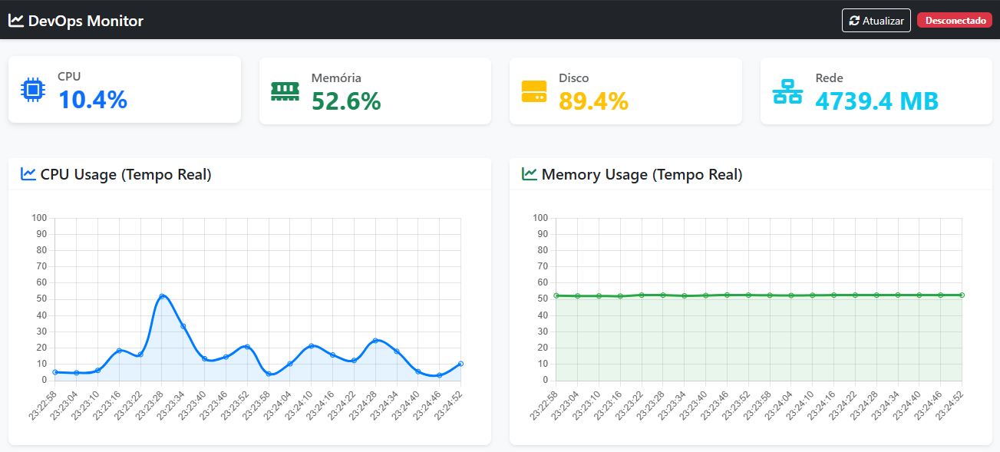
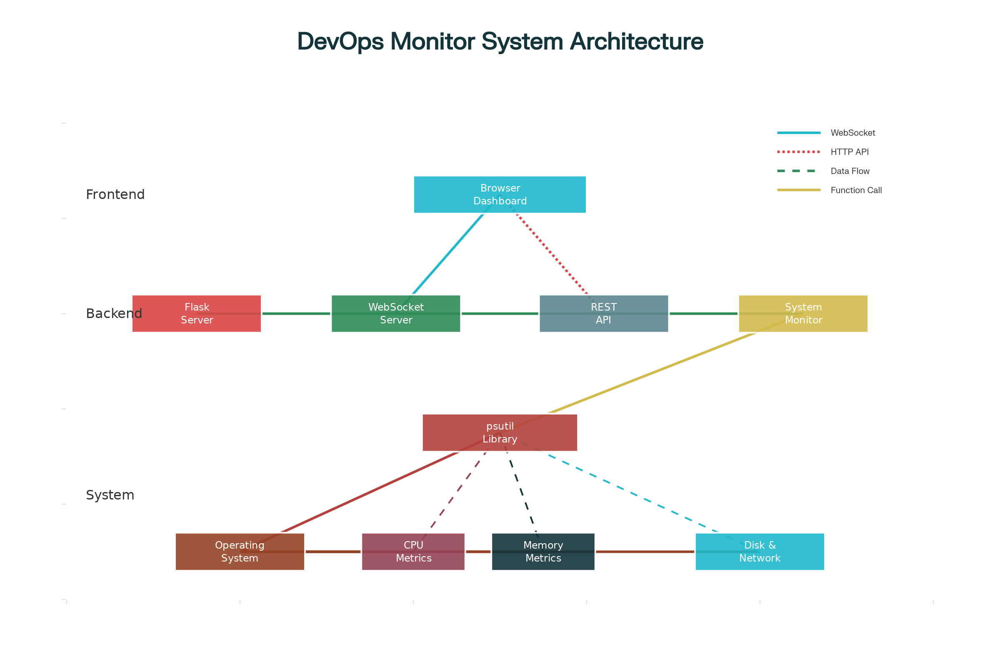

# DevOps Monitor Flask

**Sistema de Monitoramento DevOps em Tempo Real**

**fluxograma da arquitetura surgerida**

## 🌟 Visão Geral
Este projeto implementa um painel de monitoramento DevOps em tempo real usando:
- **Backend**: Flask, Flask-SocketIO, psutil
- **Frontend**: Bootstrap 5, Chart.js, WebSockets
- **Monitoramento**: CPU, Memória, Disco e Rede
- **Notificações**: Alertas configuráveis (warnings e críticos)

## 🚀 Funcionalidades Implementadas
1. Monitoramento em Tempo Real: CPU, Memória, Disco, Rede
2. WebSocket para atualizações instantâneas
3. API REST completa para integração
4. Dashboard responsivo com Bootstrap 5
5. Sistema de alertas e histórico de métricas

## 📁 Estrutura do Repositório

<<<<<<< HEAD

=======
devops_monitor_flask/
>>>>>>> d2e6433 (Fase 2: Redis + Celery + Docker Compose integrados)
├── app.py
├── celery_worker.py
├── config.py
├── monitoring.py
├── tasks.py
├── websocket_handler.py
├── test_monitoring.py
├── requirements.txt
├── .gitignore
├── Dockerfile
├── docker-compose.yml
├── README.md
└──
    ├── static/
    │   ├── css/style.css
    │   ├── js/main.js
    │   └── images/
    └── templates/index.html

## 🔧 Como Executar
1. Clone o repositório e ative o venv  
2. `pip install -r requirements.txt`  
3. `python app.py`  
4. Acesse `http://localhost:5000`  

🚀 Fase 2 – Redis + Celery + Docker Compose
O que foi implementado
Redis para cache e broker de mensagens

Celery para processamento assíncrono de tasks

Docker Compose para orquestrar Redis, Flask e Celery

Endpoint /api/test-celery para validação de tasks

Como rodar em Docker
docker-compose down

docker-compose up --build -d

Acesse http://localhost:5000

Teste Celery: http://localhost:5000/api/test-celery

Testes Manuais
REST:

GET /api/metrics

GET /api/history

GET /api/clients

GET /api/health

WebSocket: abra o dashboard e observe log de clientes conectados

Celery: verifique no log do worker as tarefas de Redis

🎯 Próximos Passos (Fase 3+)
Testes automatizados (pytest)

Pipeline CI/CD (GitHub Actions: lint, test, build, push Docker)

Ansible para deploy automatizado

Prometheus + Grafana para métricas e dashboards avançados

Notificações reais por Email, Slack e Teams via Celery

📜 Licença
MIT License

